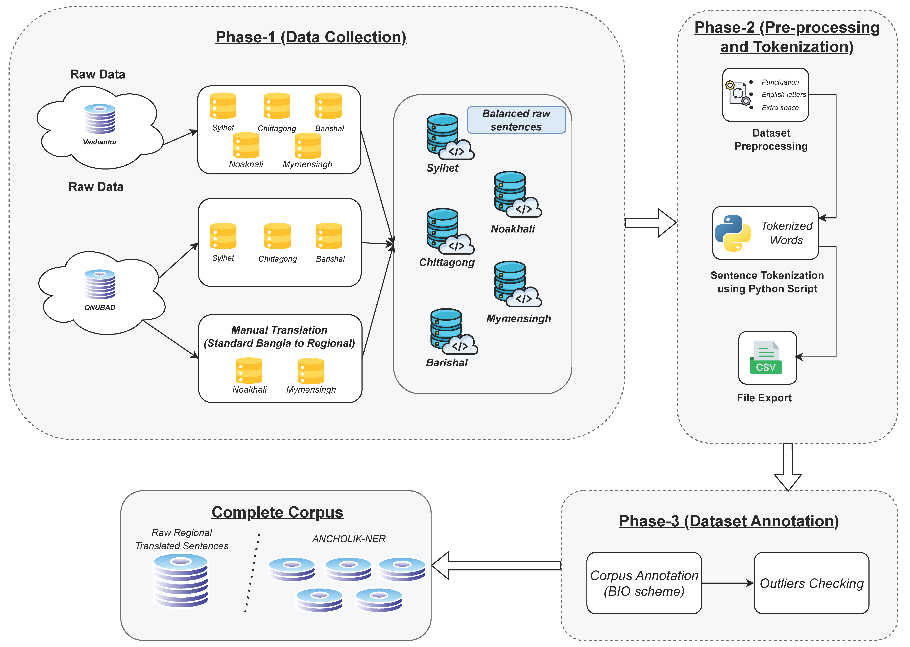
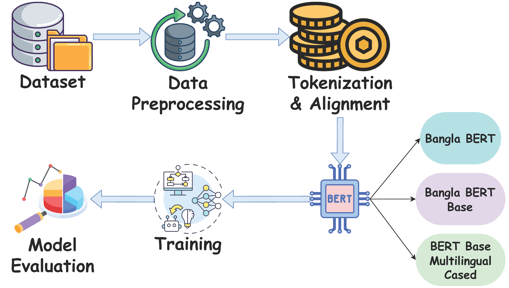

<div align="center">
<h1>ANCHOLIK-NER: A Benchmark Dataset for Bangla Regional Named Entity Recognition</h1>
</div>


## Abstract
ANCHOLIK-NER is a linguistically diverse dataset for Named Entity Recognition (NER) in Bangla regional dialects, capturing variations across Sylhet, Chittagong, Barishal, Noakhali, and Mymensingh. The dataset has around 17,405 sentences, 3,481 sentences per region. The data was collected from two publicly available datasets and through web scraping from various online newspapers, articles. To ensure high-quality annotations, the BIO tagging scheme was employed, and professional annotators with expertise in regional dialects carried out the labeling process. The dataset is structured into separate subsets for each region and is available in CSV format. Each entry contains textual data along with identified named entities and their corresponding annotations. Named entities are categorized into ten distinct classes: Person, Location, Organization, Food, Animal, Colour, Role, Relation, Object, and Miscellaneous. This dataset serves as a valuable resource for developing and evaluating NER models for Bangla dialectal variations, contributing to regional language processing and low-resource NLP applications. It can be utilized to enhance NER systems in Bangla dialects, improve regional language understanding, and support applications in machine translation, information retrieval, and conversational AI.

## Table of Contents
- [Data Availability](#data-availability)
- [Research Article Availability](#research-article-availability)
- [Named Entity Categories](#named-entity-categories)
- [Overview of Dataset](#overview-of-dataset)
- [Dataset Creation](#dataset-creation)
- [Methodology](#methodology)
- [Result Analysis](#result-analysis)
- [Funding](#funding)
- [Contact Information](#contact-information)
- [Citation of Dataset](#citation-of-dataset)
- [Citation of Research Article](#citation-of-research-article)
- [License](#license)

## Data Availability
The "ANCHOLIK-NER" dataset, available in CSV formats, is now publicly accessible in Mendeley Data. This dataset provides users with a valuable opportunity for flexible exploration and utilization in various research and analysis endeavors. You can explore and download the dataset at the following link: <b><a href="https://data.mendeley.com/datasets/gbkszkt8z3">ANCHOLIK-NER Dataset</a></b>. Feel free to leverage this resource for your research, experiments or any other analytical purposes. If you have any questions or need further assistance with the dataset, don't hesitate to reach out.

## Research Article Availability
A research article on **"ANCHOLIK-NER: A Benchmark Dataset for Bangla Regional Named Entity Recognition"** has been officially published in **PLOS One — a Q1 journal (Impact Factor: 3.2 | CiteScore: 5.6 | SJR: 0.803)**. You can read and download the article from <b><a href="https://doi.org/10.1371/journal.pone.0342786">here</a></b>. Feel free to leverage this resource for your research, experiments or any other analytical purposes.

## Named Entity Categories
The dataset includes the following named entity categories, each annotated using the BIO scheme:
- Location (LOC): B-LOC, I-LOC
- Person (PER): B-PER, I-PER
- Organization (ORG): B-ORG, I-ORG
- FOOD (FOOD): B-FOOD, I-FOOD
- Animal (ANI): B-ANI, I-ANI
- Colour (COL): B-COL, I-COL
- ROLE (ROLE): B-ROLE, I-ROLE
- Relationship (REL): B-REL, I-REL
- Object (OBJ): B-OBJ, I-OBJ
- Miscellaneous: O
    
## Overview of Dataset
### Total Instances of Named Entity Types in Five Regions

| Named Entity Type  | Barishal | Sylhet | Chittagong | Noakhali | Mymensingh | Total Instances |
|:------------------:|:--------:|:------:|:----------:|:--------:|:----------:|:---------------:|
|    Person (PER)    |    39    |   38   |     39     |    39    |     39     |       194       |
|   Location (LOC)   |    369   |  371   |    377     |   361    |    362     |      1840       |
| Organization (ORG) |    139   |  141   |    139     |   141    |    140     |       700       |
|    Food (FOOD)     |    310   |  308   |    308     |   303    |    312     |      1541       |
|    Animal (ANI)    |    57    |   56   |     57     |    57    |     57     |       284       |
|    Colour (COL)    |    162   |  167   |    160     |   164    |    163     |       816       |
|    Role (ROLE)     |    114   |  107   |    109     |   111    |    113     |       554       |
|   Relation (REL)   |    681   |  677   |    676     |   676    |    676     |      3386       |
|    Object (OBJ)    |    352   |  348   |    348     |   350    |    349     |      1747       |
| Miscellaneous (O)  |   17928  | 18750  |   18177    |  17957   |   17943    |     90755       |

### Overview of our Proposed Dataset

|    Dataset Attributes     | Frequency |
|:-------------------------:|:---------:|
| Total Number of Sentences |   17405   |
|   Total Named Entities    |   11062   |
| Total Non-Named Entities  |   90755   |
|      Sentence Length      |  [2-10]   |
|         Entities          |    10     |
|      Tagging Scheme       |    BIO    |
|      Number of Tags       |    19     |

## Dataset Creation


## Methodology


## Result Analysis

<table>
  <thead>
    <tr>
      <th align="center">Model</th>
      <th align="center">Batch Size</th>
      <th align="center">Region</th>
      <th align="center">Epoch</th>
      <th align="center">Precision</th>
      <th align="center">Recall</th>
      <th align="center">F1-score</th>
    </tr>
  </thead>
  <tbody>
    <!-- ==================== Bangla BERT ==================== -->
    <tr>
      <td rowspan="40" align="center">Bangla BERT</td>
      <td rowspan="20" align="center">8</td>
      <td rowspan="4" align="center">Barishal</td>
      <td align="center">05</td><td align="center">0.69931</td><td align="center">0.73465</td><td align="center">0.71654</td>
    </tr>
    <tr><td align="center">10</td><td align="center">0.77915</td><td align="center">0.79602</td><td align="center">0.78750</td></tr>
    <tr><td align="center">15</td><td align="center">0.80900</td><td align="center">0.81046</td><td align="center">0.80973</td></tr>
    <tr><td align="center">20</td><td align="center">0.83650</td><td align="center">0.79422</td><td align="center"><b>0.81481</b></td></tr>
    <tr>
      <td rowspan="4" align="center">Chittagong</td>
      <td align="center">05</td><td align="center">0.66775</td><td align="center">0.65806</td><td align="center">0.66287</td>
    </tr>
    <tr><td align="center">10</td><td align="center">0.76334</td><td align="center">0.69193</td><td align="center">0.72588</td></tr>
    <tr><td align="center">15</td><td align="center">0.76329</td><td align="center">0.71774</td><td align="center">0.73981</td></tr>
    <tr><td align="center">20</td><td align="center">0.76627</td><td align="center">0.74032</td><td align="center"><b>0.75307</b></td></tr>
    <tr>
      <td rowspan="4" align="center">Mymensingh</td>
      <td align="center">05</td><td align="center">0.74353</td><td align="center">0.76639</td><td align="center">0.75479</td>
    </tr>
    <tr><td align="center">10</td><td align="center">0.79446</td><td align="center">0.82377</td><td align="center">0.80885</td></tr>
    <tr><td align="center">15</td><td align="center">0.80360</td><td align="center">0.82172</td><td align="center">0.81256</td></tr>
    <tr><td align="center">20</td><td align="center">0.82780</td><td align="center">0.81762</td><td align="center"><b>0.82268</b></td></tr>
    <tr>
      <td rowspan="4" align="center">Noakhali</td>
      <td align="center">05</td><td align="center">0.65669</td><td align="center">0.69459</td><td align="center">0.67511</td>
    </tr>
    <tr><td align="center">10</td><td align="center">0.78694</td><td align="center">0.76350</td><td align="center">0.77504</td></tr>
    <tr><td align="center">15</td><td align="center">0.77692</td><td align="center">0.75232</td><td align="center">0.76442</td></tr>
    <tr><td align="center">20</td><td align="center">0.79166</td><td align="center">0.77839</td><td align="center"><b>0.78497</b></td></tr>
    <tr>
      <td rowspan="4" align="center">Sylhet</td>
      <td align="center">05</td><td align="center">0.75412</td><td align="center">0.74591</td><td align="center">0.75000</td>
    </tr>
    <tr><td align="center">10</td><td align="center">0.76363</td><td align="center">0.76225</td><td align="center">0.76294</td></tr>
    <tr><td align="center">15</td><td align="center">0.81106</td><td align="center">0.77132</td><td align="center"><b>0.79069</b></td></tr>
    <tr><td align="center">20</td><td align="center">0.79482</td><td align="center">0.78039</td><td align="center">0.78754</td></tr>
    <tr>
      <td rowspan="20" align="center">16</td>
      <td rowspan="4" align="center">Barishal</td>
      <td align="center">05</td><td align="center">0.66725</td><td align="center">0.67689</td><td align="center">0.67204</td>
    </tr>
    <tr><td align="center">10</td><td align="center">0.72972</td><td align="center">0.77978</td><td align="center">0.75392</td></tr>
    <tr><td align="center">15</td><td align="center">0.77640</td><td align="center">0.79602</td><td align="center">0.78609</td></tr>
    <tr><td align="center">20</td><td align="center">0.78368</td><td align="center">0.79783</td><td align="center"><b>0.79069</b></td></tr>
    <tr>
      <td rowspan="4" align="center">Chittagong</td>
      <td align="center">05</td><td align="center">0.60202</td><td align="center">0.57580</td><td align="center">0.58862</td>
    </tr>
    <tr><td align="center">10</td><td align="center">0.66944</td><td align="center">0.64677</td><td align="center">0.65791</td></tr>
    <tr><td align="center">15</td><td align="center">0.73445</td><td align="center">0.70483</td><td align="center">0.71934</td></tr>
    <tr><td align="center">20</td><td align="center">0.75043</td><td align="center">0.69838</td><td align="center"><b>0.72347</b></td></tr>
    <tr>
      <td rowspan="4" align="center">Mymensingh</td>
      <td align="center">05</td><td align="center">0.66358</td><td align="center">0.73565</td><td align="center">0.69776</td>
    </tr>
    <tr><td align="center">10</td><td align="center">0.77354</td><td align="center">0.79098</td><td align="center">0.78216</td></tr>
    <tr><td align="center">15</td><td align="center">0.81069</td><td align="center">0.80737</td><td align="center">0.80903</td></tr>
    <tr><td align="center">20</td><td align="center">0.82244</td><td align="center">0.82581</td><td align="center"><b>0.82413</b></td></tr>
    <tr>
      <td rowspan="4" align="center">Noakhali</td>
      <td align="center">05</td><td align="center">0.56856</td><td align="center">0.63314</td><td align="center">0.59911</td>
    </tr>
    <tr><td align="center">10</td><td align="center">0.72413</td><td align="center">0.74301</td><td align="center">0.73345</td></tr>
    <tr><td align="center">15</td><td align="center">0.77042</td><td align="center">0.73743</td><td align="center">0.75356</td></tr>
    <tr><td align="center">20</td><td align="center">0.77716</td><td align="center">0.78584</td><td align="center"><b>0.78148</b></td></tr>
    <tr>
      <td rowspan="4" align="center">Sylhet</td>
      <td align="center">05</td><td align="center">0.65277</td><td align="center">0.68239</td><td align="center">0.66725</td>
    </tr>
    <tr><td align="center">10</td><td align="center">0.75591</td><td align="center">0.75317</td><td align="center">0.75454</td></tr>
    <tr><td align="center">15</td><td align="center">0.77614</td><td align="center">0.76769</td><td align="center">0.77189</td></tr>
    <tr><td align="center">20</td><td align="center">0.79777</td><td align="center">0.78039</td><td align="center"><b>0.78899</b></td></tr>
    <!-- ==================== Bangla BERT Base ==================== -->
    <tr>
      <td rowspan="40" align="center">Bangla BERT Base</td>
      <td rowspan="20" align="center">8</td>
      <td rowspan="4" align="center">Barishal</td>
      <td align="center">05</td><td align="center">0.80711</td><td align="center">0.76424</td><td align="center">0.78509</td>
    </tr>
    <tr><td align="center">10</td><td align="center">0.81292</td><td align="center">0.76554</td><td align="center">0.78852</td></tr>
    <tr><td align="center">15</td><td align="center">0.82216</td><td align="center">0.77849</td><td align="center"><b>0.79973</b></td></tr>
    <tr><td align="center">20</td><td align="center">0.82753</td><td align="center">0.77072</td><td align="center">0.79812</td></tr>
    <tr>
      <td rowspan="4" align="center">Chittagong</td>
      <td align="center">05</td><td align="center">0.76062</td><td align="center">0.64314</td><td align="center">0.69696</td>
    </tr>
    <tr><td align="center">10</td><td align="center">0.75888</td><td align="center">0.65379</td><td align="center">0.70243</td></tr>
    <tr><td align="center">15</td><td align="center">0.77864</td><td align="center">0.66045</td><td align="center"><b>0.71469</b></td></tr>
    <tr><td align="center">20</td><td align="center">0.78964</td><td align="center">0.64980</td><td align="center">0.71292</td></tr>
    <tr>
      <td rowspan="4" align="center">Mymensingh</td>
      <td align="center">05</td><td align="center">0.79663</td><td align="center">0.77645</td><td align="center">0.78641</td>
    </tr>
    <tr><td align="center">10</td><td align="center">0.82942</td><td align="center">0.78986</td><td align="center"><b>0.80916</b></td></tr>
    <tr><td align="center">15</td><td align="center">0.81720</td><td align="center">0.79284</td><td align="center">0.80484</td></tr>
    <tr><td align="center">20</td><td align="center">0.82453</td><td align="center">0.79135</td><td align="center">0.80760</td></tr>
    <tr>
      <td rowspan="4" align="center">Noakhali</td>
      <td align="center">05</td><td align="center">0.80613</td><td align="center">0.73382</td><td align="center">0.76828</td>
    </tr>
    <tr><td align="center">10</td><td align="center">0.82013</td><td align="center">0.73088</td><td align="center">0.77293</td></tr>
    <tr><td align="center">15</td><td align="center">0.81892</td><td align="center">0.73823</td><td align="center">0.77648</td></tr>
    <tr><td align="center">20</td><td align="center">0.81451</td><td align="center">0.74264</td><td align="center"><b>0.77692</b></td></tr>
    <tr>
      <td rowspan="4" align="center">Sylhet</td>
      <td align="center">05</td><td align="center">0.81481</td><td align="center">0.70375</td><td align="center">0.75522</td>
    </tr>
    <tr><td align="center">10</td><td align="center">0.80821</td><td align="center">0.73852</td><td align="center">0.77180</td></tr>
    <tr><td align="center">15</td><td align="center">0.84025</td><td align="center">0.73157</td><td align="center"><b>0.78215</b></td></tr>
    <tr><td align="center">20</td><td align="center">0.82884</td><td align="center">0.72739</td><td align="center">0.77481</td></tr>
    <tr>
      <td rowspan="20" align="center">16</td>
      <td rowspan="4" align="center">Barishal</td>
      <td align="center">05</td><td align="center">0.78035</td><td align="center">0.74093</td><td align="center">0.76013</td>
    </tr>
    <tr><td align="center">10</td><td align="center">0.79782</td><td align="center">0.76165</td><td align="center">0.77932</td></tr>
    <tr><td align="center">15</td><td align="center">0.80636</td><td align="center">0.75518</td><td align="center"><b>0.77993</b></td></tr>
    <tr><td align="center">20</td><td align="center">0.82419</td><td align="center">0.75906</td><td align="center">0.79028</td></tr>
    <tr>
      <td rowspan="4" align="center">Chittagong</td>
      <td align="center">05</td><td align="center">0.74720</td><td align="center">0.62183</td><td align="center">0.67877</td>
    </tr>
    <tr><td align="center">10</td><td align="center">0.76443</td><td align="center">0.65246</td><td align="center">0.70402</td></tr>
    <tr><td align="center">15</td><td align="center">0.77974</td><td align="center">0.64580</td><td align="center">0.70648</td></tr>
    <tr><td align="center">20</td><td align="center">0.78378</td><td align="center">0.65645</td><td align="center"><b>0.71449</b></td></tr>
    <tr>
      <td rowspan="4" align="center">Mymensingh</td>
      <td align="center">05</td><td align="center">0.79750</td><td align="center">0.76304</td><td align="center">0.77989</td>
    </tr>
    <tr><td align="center">10</td><td align="center">0.81933</td><td align="center">0.77049</td><td align="center">0.79416</td></tr>
    <tr><td align="center">15</td><td align="center">0.81212</td><td align="center">0.79880</td><td align="center"><b>0.80540</b></td></tr>
    <tr><td align="center">20</td><td align="center">0.83360</td><td align="center">0.76900</td><td align="center">0.80000</td></tr>
    <tr>
      <td rowspan="4" align="center">Noakhali</td>
      <td align="center">05</td><td align="center">0.77777</td><td align="center">0.71029</td><td align="center">0.74250</td>
    </tr>
    <tr><td align="center">10</td><td align="center">0.80913</td><td align="center">0.72941</td><td align="center">0.76720</td></tr>
    <tr><td align="center">15</td><td align="center">0.78615</td><td align="center">0.75147</td><td align="center">0.76842</td></tr>
    <tr><td align="center">20</td><td align="center">0.80868</td><td align="center">0.73970</td><td align="center"><b>0.77265</b></td></tr>
    <tr>
      <td rowspan="4" align="center">Sylhet</td>
      <td align="center">05</td><td align="center">0.79047</td><td align="center">0.69262</td><td align="center">0.73832</td>
    </tr>
    <tr><td align="center">10</td><td align="center">0.82108</td><td align="center">0.71488</td><td align="center">0.76431</td></tr>
    <tr><td align="center">15</td><td align="center">0.82103</td><td align="center">0.72739</td><td align="center"><b>0.77138</b></td></tr>
    <tr><td align="center">20</td><td align="center">0.82467</td><td align="center">0.70653</td><td align="center">0.76104</td></tr>
    <!-- ==================== BERT Base Multilingual Cased ==================== -->
    <tr>
      <td rowspan="40" align="center">BERT Base Multilingual Cased</td>
      <td rowspan="20" align="center">8</td>
      <td rowspan="4" align="center">Barishal</td>
      <td align="center">05</td><td align="center">0.72710</td><td align="center">0.72448</td><td align="center">0.72579</td>
    </tr>
    <tr><td align="center">10</td><td align="center">0.77556</td><td align="center">0.77416</td><td align="center">0.77486</td></tr>
    <tr><td align="center">15</td><td align="center">0.78690</td><td align="center">0.77055</td><td align="center"><b>0.77863</b></td></tr>
    <tr><td align="center">20</td><td align="center">0.78451</td><td align="center">0.75971</td><td align="center">0.77191</td></tr>
    <tr>
      <td rowspan="4" align="center">Chittagong</td>
      <td align="center">05</td><td align="center">0.74456</td><td align="center">0.70801</td><td align="center">0.72582</td>
    </tr>
    <tr><td align="center">10</td><td align="center">0.79777</td><td align="center">0.74074</td><td align="center">0.73820</td></tr>
    <tr><td align="center">15</td><td align="center">0.77390</td><td align="center">0.74590</td><td align="center">0.75964</td></tr>
    <tr><td align="center">20</td><td align="center">0.77531</td><td align="center">0.75258</td><td align="center"><b>0.76377</b></td></tr>
    <tr>
      <td rowspan="4" align="center">Mymensingh</td>
      <td align="center">05</td><td align="center">0.78199</td><td align="center">0.78476</td><td align="center">0.78337</td>
    </tr>
    <tr><td align="center">10</td><td align="center">0.82411</td><td align="center">0.80513</td><td align="center">0.81451</td></tr>
    <tr><td align="center">15</td><td align="center">0.83455</td><td align="center">0.80425</td><td align="center">0.81912</td></tr>
    <tr><td align="center">20</td><td align="center">0.85682</td><td align="center">0.79752</td><td align="center"><b>0.82611</b></td></tr>
    <tr>
      <td rowspan="4" align="center">Noakhali</td>
      <td align="center">05</td><td align="center">0.73551</td><td align="center">0.76977</td><td align="center">0.75225</td>
    </tr>
    <tr><td align="center">10</td><td align="center">0.80344</td><td align="center">0.77943</td><td align="center">0.79125</td></tr>
    <tr><td align="center">15</td><td align="center">0.79355</td><td align="center">0.80052</td><td align="center">0.79702</td></tr>
    <tr><td align="center">20</td><td align="center">0.81914</td><td align="center">0.81195</td><td align="center"><b>0.81553</b></td></tr>
    <tr>
      <td rowspan="4" align="center">Sylhet</td>
      <td align="center">05</td><td align="center">0.74363</td><td align="center">0.73100</td><td align="center">0.73726</td>
    </tr>
    <tr><td align="center">10</td><td align="center">0.80471</td><td align="center">0.76228</td><td align="center">0.78292</td></tr>
    <tr><td align="center">15</td><td align="center">0.84789</td><td align="center">0.77211</td><td align="center">0.80823</td></tr>
    <tr><td align="center">20</td><td align="center">0.82053</td><td align="center">0.82578</td><td align="center"><b>0.82315</b></td></tr>
    <tr>
      <td rowspan="20" align="center">16</td>
      <td rowspan="4" align="center">Barishal</td>
      <td align="center">05</td><td align="center">0.70953</td><td align="center">0.73261</td><td align="center">0.72088</td>
    </tr>
    <tr><td align="center">10</td><td align="center">0.75559</td><td align="center">0.73170</td><td align="center">0.74346</td></tr>
    <tr><td align="center">15</td><td align="center">0.77674</td><td align="center">0.75429</td><td align="center">0.76535</td></tr>
    <tr><td align="center">20</td><td align="center">0.79061</td><td align="center">0.76061</td><td align="center"><b>0.77532</b></td></tr>
    <tr>
      <td rowspan="4" align="center">Chittagong</td>
      <td align="center">05</td><td align="center">0.69299</td><td align="center">0.66494</td><td align="center">0.67868</td>
    </tr>
    <tr><td align="center">10</td><td align="center">0.75837</td><td align="center">0.72179</td><td align="center">0.73962</td></tr>
    <tr><td align="center">15</td><td align="center">0.78317</td><td align="center">0.72179</td><td align="center">0.75123</td></tr>
    <tr><td align="center">20</td><td align="center">0.79329</td><td align="center">0.73385</td><td align="center"><b>0.76241</b></td></tr>
    <tr>
      <td rowspan="4" align="center">Mymensingh</td>
      <td align="center">05</td><td align="center">0.74825</td><td align="center">0.75819</td><td align="center">0.75318</td>
    </tr>
    <tr><td align="center">10</td><td align="center">0.79464</td><td align="center">0.78830</td><td align="center">0.79146</td></tr>
    <tr><td align="center">15</td><td align="center">0.82384</td><td align="center">0.80779</td><td align="center"><b>0.81574</b></td></tr>
    <tr><td align="center">20</td><td align="center">0.81478</td><td align="center">0.81045</td><td align="center">0.81261</td></tr>
    <tr>
      <td rowspan="4" align="center">Noakhali</td>
      <td align="center">05</td><td align="center">0.70320</td><td align="center">0.73286</td><td align="center">0.71772</td>
    </tr>
    <tr><td align="center">10</td><td align="center">0.78892</td><td align="center">0.80140</td><td align="center">0.79511</td></tr>
    <tr><td align="center">15</td><td align="center">0.78747</td><td align="center">0.78471</td><td align="center">0.78609</td></tr>
    <tr><td align="center">20</td><td align="center">0.80926</td><td align="center">0.78295</td><td align="center"><b>0.79589</b></td></tr>
    <tr>
      <td rowspan="4" align="center">Sylhet</td>
      <td align="center">05</td><td align="center">0.68643</td><td align="center">0.68275</td><td align="center">0.68458</td>
    </tr>
    <tr><td align="center">10</td><td align="center">0.78133</td><td align="center">0.76318</td><td align="center">0.77215</td></tr>
    <tr><td align="center">15</td><td align="center">0.80461</td><td align="center">0.74709</td><td align="center">0.77479</td></tr>
    <tr><td align="center">20</td><td align="center">0.79390</td><td align="center">0.76764</td><td align="center"><b>0.78055</b></td></tr>
  </tbody>
</table>

## Funding
This study was funded by <b>Institute of Research and Training, Southeast University, Bangladesh</b>. Hence, we had financial support. <b>Southeast University, Bangladesh (SEU/IRT/RG/2025/01/09 to M.A.H.)</b>.

## Contact Information

For any questions or further inquiries, please feel free to reach out:

- **Bidyarthi Paul**
  - Email: [bidyarthipaul01@gmail.com](mailto:bidyarthipaul01@gmail.com)

- **Faika Fairuj Preotee**
  - Email: [faikafairuj2001@gmail.com](mailto:faikafairuj2001@gmail.com)

- **Shuvashis Sarkar**
  - Email: [shuvashisofficial@gmail.com](mailto:shuvashisofficial@gmail.com)

- **Shamim Rahim Refat**
  - Email: [n.a.refat2000@gmail.com](mailto:n.a.refat2000@gmail.com)

- **Shifat Islam**
  - Email: [tashreef.muhammad@gmail.com](mailto:shifat.islam.buet@gmail.com)
  
- **Tashreef Muhammad**
  - Email: [tashreef.muhammad@gmail.com](mailto:tashreef.muhammad@gmail.com)

- **Mohammad Ashraful Hoque**
  - Email: [ashraful@seu.edu.bd](mailto:ashraful@seu.edu.bd)

- **Shahriar Manzoor**
  - Email: [smanzoor@seu.edu.bd](mailto:smanzoor@seu.edu.bd)
    
## Citation of Dataset
If you find the dataset helpful, please consider citing our dataset:

```plaintext
Paul, Bidyarthi; Preotee, Faika Fairuj; Sarker, Shuvashis; 
Refat, Shamim Rahim; Islam, Shifat; Muhammad, Tashreef; 
Hoque, Mohammad Ashraful; Manzoor, Shahriar (2025), 
“ANCHOLIK-NER: A Benchmark Dataset for Bangla Regional Named Entity Recognition”, 
Mendeley Data, V3, doi: 10.17632/gbkszkt8z3.3
```

## Citation of Research Article
If you find the research work helpful, please consider citing our paper:

```bibtex
@article{10.1371/journal.pone.0342786,
    doi = {10.1371/journal.pone.0342786},
    author = {Paul, Bidyarthi AND Preotee, Faika Fairuj AND Sarker, Shuvashis AND Refat, Shamim Rahim AND Islam, Shifat AND Muhammad, Tashreef AND Hoque, Mohammad Ashraful AND Manzoor, Shahriar},
    journal = {PLOS ONE},
    publisher = {Public Library of Science},
    title = {ANCHOLIK-NER: A benchmark dataset for Bangla regional named entity recognition},
    year = {2026},
    month = {02},
    volume = {21},
    url = {https://doi.org/10.1371/journal.pone.0342786},
    pages = {1-36},
    abstract = {Named Entity Recognition (NER) in regional dialects is a critical yet underexplored area in Natural Language Processing (NLP), especially for low-resource languages like Bangla. While NER systems for Standard Bangla have made progress, no existing resources or models specifically address the challenge of regional dialects such as Barishal, Chittagong, Mymensingh, Noakhali, and Sylhet, which exhibit unique linguistic features that existing models fail to handle effectively. To fill this gap, we introduce ANCHOLIK-NER, the first benchmark dataset for NER in Bangla regional dialects, comprising 17,405 sentences and 101,817 words annotated with 10 entity tags across 5 regions. The dataset was sourced from publicly available resources and supplemented with manual translations, ensuring alignment of named entities across dialects. We evaluate three transformer-based models—Bangla BERT, Bangla Bert Base, and BERT Base Multilingual Cased—on this dataset. Bangla BERT achieved the highest performance overall, with F1-scores of 82.27% (Mymensingh), 81.48% (Barishal), 78.75% (Sylhet), 78.50% (Noakhali), and 75.31% (Chittagong). These results highlight strong recognition capability in Mymensingh and Barishal, while dialectal variation in Chittagong remains challenging. As no prior NER resources exist for Bangla regional dialects, this work provides a foundational dataset and baseline benchmarks to facilitate future research. Future work will focus on dialect-aware model adaptation and expanding coverage to additional regions.},
    number = {2},

}
```
